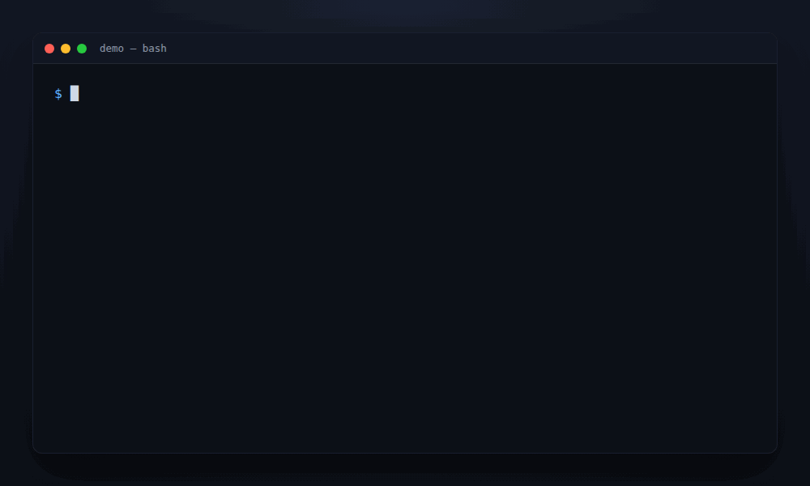

<div align="center">


# pgapp

### Your whole app is one text file. Postgres is the backend.

**One file. One binary. Your database.**

Reports, forms, charts, auth, and a point-and-click builder — described in
plain text. A single Rust binary reads it, keeps the app's definition in
Postgres, and serves the whole thing straight from the database.

No ORM. No API layer. No JS build step. No second system to babysit.

[](https://github.com/aadishajay/pgapp/actions/workflows/ci.yml)
[](./LICENSE)
[](https://www.rust-lang.org/)
[](https://www.postgresql.org/)
[](https://github.com/aadishajay/pgapp/stargazers)

[**Quick start**](#quick-start) ·
[**See it in 30 lines**](#a-full-app-in-30-lines) ·
[**App Builder**](#the-app-builder) ·
[**Docs**](./docs/README.md) ·
[**How it compares**](#how-it-compares)

<br>



<sub>Add a column to the <code>.pgapp</code> file, <code>:wq</code>, <code>pgapp run</code> — the app is live at its own URL, new column and all. No restart, no API layer, no build step.</sub>

</div>

---

> **Status:** pre-1.0 and actively developed. No stability guarantees
> yet — read the [Roadmap](./docs/roadmap.md) before you depend on it in
> production. Everything documented below works today.

## The problem

You have a Postgres database, and you need the boring part around it: a
few CRUD screens, a couple of dashboards, logins, an admin panel.

The usual options make you stand up a *second* system just to get there
— a BaaS with its own auth service and API gateway, a low-code SaaS with
its own hosted runtime, or a Node/Next backend you write, deploy, and
keep alive. If Postgres already holds your data, every one of those is
an extra moving part between you and shipping.

## What pgapp does instead

pgapp deletes that layer.

You describe the app in one plain-text `.pgapp` file — entities, pages,
reports, forms, charts, auth — and a **single Rust binary** reads it,
syncs the definition into Postgres as ordinary rows, builds
parameterized SQL, and renders the HTML itself.

No PostgREST. No Studio. No generated client SDK. No JS toolchain. Edit
the file — or click through the built-in [App Builder](#the-app-builder)
— and reload. **That's the entire deploy loop.**

It's the Oracle APEX development model — Interactive Reports, PL/SQL-style
server actions, declarative dynamic actions — rebuilt as an open,
self-hosted, git-diffable, single-binary alternative that runs on
infrastructure you already have.

## A full app in 30 lines

```text
app "Todo" {
  nav {
    item "Tasks" -> page Tasks
  }

  entity "tasks" {
    field id: id
    field title: text required
    field priority: text default Medium
    field done: boolean default false
  }

  page "Tasks" {
    report "Tasks" of tasks {
      columns: title, priority, done
      page_size: 10
    }

    form "Add / edit task" of tasks {
      fields: title, priority, done
      item priority as radio ("Low", "Medium", "High")
    }
  }
}
```

That's a **searchable, paginated, sortable list with inline
create/edit/delete** — the classic Report+Form CRUD pattern — wired up
automatically because the Form and Report share an entity on the same
page.

No route handlers. No SQL. No client-side JS written by you. The full
grammar — named queries, every component kind, one-file or a directory —
is in the [markup reference](./docs/markup.md).

## See it

<table>
<tr>
<td width="50%">

**Interactive Report** — faceted search, sortable columns, and a
visible cue (that `→`) telling you a row is clickable before you ever
touch the mouse.


</td>
<td width="50%">

**Charts from one line of SQL each** — bar, donut, pie, and more, every
category getting its own consistent color automatically.


</td>
</tr>
<tr>
<td width="50%">

**The App Builder's entity editor** — pick a real table, and its
columns, nullability, and primary key populate the field list for you.


</td>
<td width="50%">

**The App Builder's page designer** — a component tree on the left, a
live property panel on the right, changes saved straight to the `.pgapp`
file.


</td>
</tr>
</table>

<details>
<summary><b>Editing raw markup in the built-in file editor</b> (VS-Code-style tree, saved straight to disk)</summary>

<br>


</details>

More screenshots and a full feature-by-feature tour live in
[`marketing/`](./marketing/index.html).

## Quick start

**Prerequisites:** a reachable Postgres server, and Rust installed.

```bash
# 1. Build and install the binary
cargo install --path .

# 2. One-time setup: an instance (per machine), a workspace (a schema
#    for your app's tables), and a scaffolded starter app in it
pgapp instance init
pgapp workspace create --schema demo
pgapp app create --workspace demo

# 3. Serve it — this prints the app's URL and starts serving
pgapp run <generated-file>.pgapp --workspace demo
```

Every step is interactive and prompts you for what it needs. That's the
whole loop.

**Prefer to see everything first?** Run the bundled showcase instead of
a blank scaffold:

```bash
pgapp workspace create --schema demo
pgapp run examples/showcase.pgapp --workspace demo
```

`examples/showcase.pgapp` is a single file exercising every component
kind — reports, forms, an editable table, all six chart types, a
calendar, a map, faceted search, dynamic actions — with a Home page
linking to each. Full walkthrough with seed data:
[Getting started](./docs/getting-started.md).

## Features

- **One file describes the whole app** — pages, entities, queries, nav,
  auth — synced on startup and on `/admin/reload`, no restart needed.
- **13 component kinds**: Report, Form, EditableTable, Chart, Calendar,
  Map, FacetedSearch, Region, DynamicContent, Action, Button, Link,
  Text. → [Components](./docs/components.md)
- **Interactive Reports** — search, per-column filters, saved views,
  sorting, aggregates, control breaks, CSV export — all declarative. →
  [Reports](./docs/reports.md)
- **19 built-in form field types**, plus a one-file-per-type plugin
  point for your own. → [Forms](./docs/forms.md)
- **6 chart types**, dependency-free inline SVG by default — or swap in
  any JS charting library. → [Charts](./docs/charts.md)
- **Server-side actions** — a Rust module or a plain PL/pgSQL call —
  wired to a button, a dynamic action, or a report's `before_load`. →
  [Actions](./docs/actions.md)
- **Declarative dynamic actions** (`on change of x { show/hide/set/
  refresh }`) plus a no-reload ajax callback.
- **Auth in one block** — `auth { }` turns on argon2-hashed logins,
  server-side sessions, and role-gated pages and components, down to a
  single button. → [Authentication](./docs/authentication.md)
- **Pluggable everything** — themes, icons, chart backends, form
  widgets; six themes shipped. → [Theming](./docs/themes.md)
- **A built-in point-and-click admin app** for all of the above —
  including an APEX-SQL-Workshop-style ad-hoc SQL runner + object
  browser, and a clone-and-edit theme editor. → [App Builder](#the-app-builder)
- **Multi-tenant from one process** — instance → workspace (schema) →
  app, one connection pool for any number of apps. →
  [Architecture](./docs/architecture.md)

## What makes it different

pgapp reimplements a lot of genuinely good ideas from Oracle APEX. That
borrowing isn't the interesting part. These design decisions are:

- **The app *is* a portable text file, and the GUI never breaks that.**
  Every App Builder mutation is a line-based **text splice** into your
  actual `.pgapp` file — hand-written formatting and comments on
  everything you *didn't* touch survive byte-for-byte. Click through the
  UI or hand-edit the file: same source of truth, both diff-friendly in
  git.

- **Bind types come from Postgres, not from you.** A named query's
  `:param` markers get their type by asking Postgres's own wire-protocol
  `Describe` message what each one needs — fresh on every sync, no
  hand-declared cast, no ORM model layer to drift out of sync.

- **One process, N tenants, hot-registered.** `pgapp run` adds an app to
  a live server's routing table with no restart and no downtime for
  anything already serving.

- **The admin builder can't edit itself** — on purpose, enforced in two
  independent places (once in the listing, again server-side on every
  mutating route). A small, deliberate safety property most self-hosted
  admin tools don't bother with.

## Architecture

```
 .pgapp markup file
        │  parse
        ▼
    AppDef (in memory)
        │  validate + sync
        ▼
 pgapp_meta.* tables  ──creates──▶  <workspace_schema>.<table>  (your real data)
        │  load
        ▼
    RuntimeApp { pages → components }
        │
        ▼
   Axum router  ──  generic, metadata-driven CRUD + JSON
```

One Rust binary, one shared Postgres connection pool, any number of
apps. Every SQL **identifier** used at request time is validated at sync
time against the lexer's own charset — safe to splice into generated
SQL; every user **value** is always a bind parameter. Full diagram,
source layout, and the complete route table:
[Architecture](./docs/architecture.md).

## Example applications

Real apps you can run, not toy snippets — including the load-test fixture:

| App | What it shows |
|---|---|
| [`examples/todo.pgapp`](./examples/todo.pgapp) | The minimal shape — one entity, Report+Form CRUD, a chart |
| [`examples/helpdesk.pgapp`](./examples/helpdesk.pgapp) | Two entities, dashboards, both pagination modes, auth, every item type, the `vivid` theme |
| [`examples/venpay.pgapp`](./examples/venpay.pgapp) | A real Oracle APEX app hand-ported over — see [Migrating from Oracle APEX](./docs/migration-from-apex.md) |
| [`examples/showcase.pgapp`](./examples/showcase.pgapp) | Every component kind, all six chart types, all three server-side action styles, in 12 pages |
| [`examples/helpdesk-modular/`](./examples/helpdesk-modular/) | The helpdesk app split across files instead of one — same grammar, zero refactoring |
| [`examples/nexus-erp/`](./examples/nexus-erp/) | **200 pages, 60 entities, 15 files.** The load-test fixture: 30 threads sustained **~900 req/s** (p50 ~27 ms, p99 ~94 ms) with **zero errors** |

## The App Builder

Every pgapp instance ships with a built-in admin app at `/pgapp/builder`,
provisioned automatically — so you can build and edit apps by clicking
instead of hand-editing markup over SSH.

It gives you an APEX-Page-Designer-style split view (clickable component
tree + a docked, typed property editor), full data-model and named-query
editing with suggestions drawn from your real Postgres columns, encrypted
secrets, an ad-hoc SQL runner with an object browser, a clone-and-edit
theme editor, and live app/workspace scaffolding or teardown.

The twist: **the App Builder is itself just a pgapp app** — not a bespoke
panel bolted onto the framework — with one deliberate exception, a
hardcoded guard that refuses to let it edit itself.

<div align="center">

<br>
<sub>Scaffolding a brand-new app in the builder — name it, pick a workspace and theme, and it's live. Every click is a text splice into a real <code>.pgapp</code> file.</sub>
</div>

Full walkthrough: [App Builder](./docs/app-builder.md).

## How it compares

pgapp occupies a narrower, more opinionated niche than the tools people
reach for first. Worth knowing before you pick it:

| | **pgapp** | Supabase | PocketBase | Appsmith / Budibase / ToolJet |
|---|---|---|---|---|
| Core language | Rust | Mostly TS + Postgres extensions | Go | Java / Node (varies) |
| App definition | Plain-text file, versioned in git | Dashboard + SQL + client SDKs | Dashboard + client SDKs | Drag-and-drop, stored as JSON |
| Database | Postgres — bring your own | Postgres (managed or self-hosted) | SQLite, embedded | Connects to a DB you already run |
| Runtime shape | One static binary | Multi-container stack (Studio, GoTrue, PostgREST, Realtime, Kong, …) | One static binary | An app server (Node/Java) you deploy |
| Admin / builder UI | Built in, itself a pgapp app | Separate Studio service | Built-in admin UI | Yes — it *is* the product |
| Best fit | Postgres-first teams wanting typed CRUD apps fast, minimal moving parts | Full BaaS: auth, storage, realtime, edge functions | Small embedded backends, single-binary deploys | Internal-tool builders, DB-agnostic, team-oriented |

None of these is strictly "better." pgapp is for the case where Postgres
**already** is the answer to "where does the data live." Want a full BaaS
(auth/storage/realtime/edge functions)? Supabase is the more complete
answer. Need it DB-agnostic and team-oriented? Reach for an internal-tool
builder.

## Documentation

The README is the pitch. The [docs](./docs/README.md) are the reference:

| Doc | What's in it |
|---|---|
| [Getting started](./docs/getting-started.md) | Install, run your first app, bundled demos, scaffolding, instance mode |
| [Architecture](./docs/architecture.md) | The markup → metadata → runtime pipeline, source layout, full route table, multi-app routing |
| [Markup language](./docs/markup.md) | The complete `.pgapp` grammar — entities, pages, queries, directories, collections |
| [Components](./docs/components.md) | Every component kind in depth |
| [Reports](./docs/reports.md) | Pagination, search & saved views, computed columns, format masks, pre-load actions |
| [Forms & item types](./docs/forms.md) | The `ItemType` trait and every built-in field widget |
| [Charts & icons](./docs/charts.md) | Chart types, pluggable rendering backends, icon packs |
| [Authentication](./docs/authentication.md) | `auth {}`, roles, component-level `requires:`, auth schemes |
| [Actions](./docs/actions.md) | Server-side action modules, dynamic actions, ajax callbacks |
| [Theming](./docs/themes.md) | The CSS contract, shipped themes, the theme editor, mobile |
| [App Builder](./docs/app-builder.md) | The full point-and-click admin app walkthrough |
| [Migrating from Oracle APEX](./docs/migration-from-apex.md) | Concept-for-concept mapping table |
| [Secrets](./docs/secrets.md) | Encrypted-at-rest credentials for actions |
| [Roadmap](./docs/roadmap.md) | Known gaps, honestly listed |

## Roadmap

pgapp is intentionally the smallest end-to-end loop, not the finished
framework. No real foreign-key relationships yet, no multi-step flow
blocks, no drag-and-drop free page composition — the full, honest list,
with the reasoning behind each gap, is in
[docs/roadmap.md](./docs/roadmap.md).

If one of those is a dealbreaker for you, that's useful to know up front
— and exactly the kind of thing a PR is welcome for.

## Contributing

Issues and PRs are welcome. This is early, opinionated software, and
outside perspective on where it breaks is genuinely useful. Good first
places to look:

- [docs/roadmap.md](./docs/roadmap.md) — known gaps
- `src/item_types/` — add a form field type (`date.rs` is the smallest
  real example)
- `src/actions/` — add a server-side action module
- `themes/` — add a design system (pure CSS, no Rust)

No `CONTRIBUTING.md` or issue templates yet — open an issue or a PR and
it'll get a response.

## License

[MIT](./LICENSE).

<div align="center">
<br>

**If pgapp is the shape of tool you've wanted for Postgres, a ⭐ helps
other people find it.**

[Quick start](#quick-start) ·
[Docs](./docs/README.md) ·
[Roadmap](./docs/roadmap.md) ·
[App Builder](./docs/app-builder.md)

</div>
