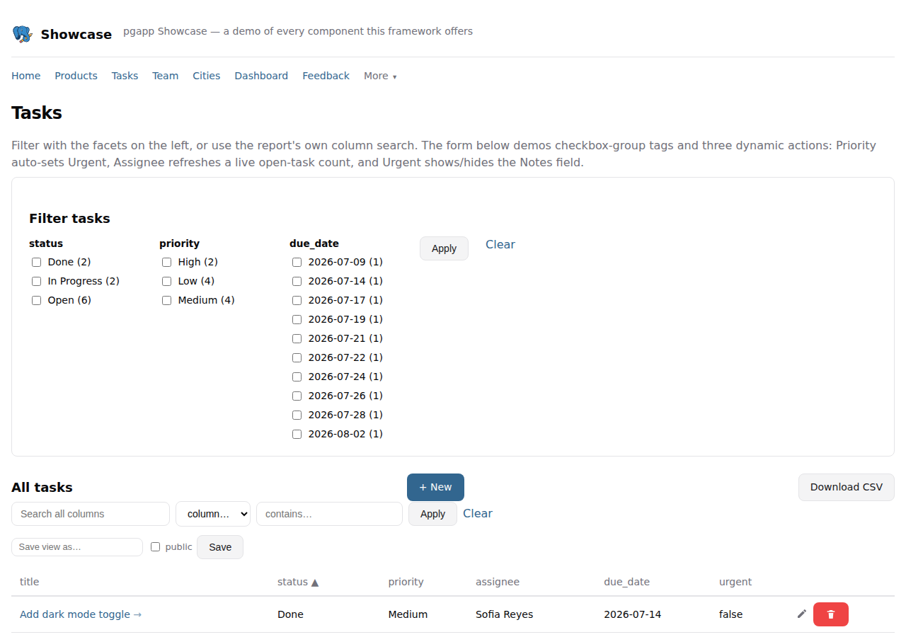
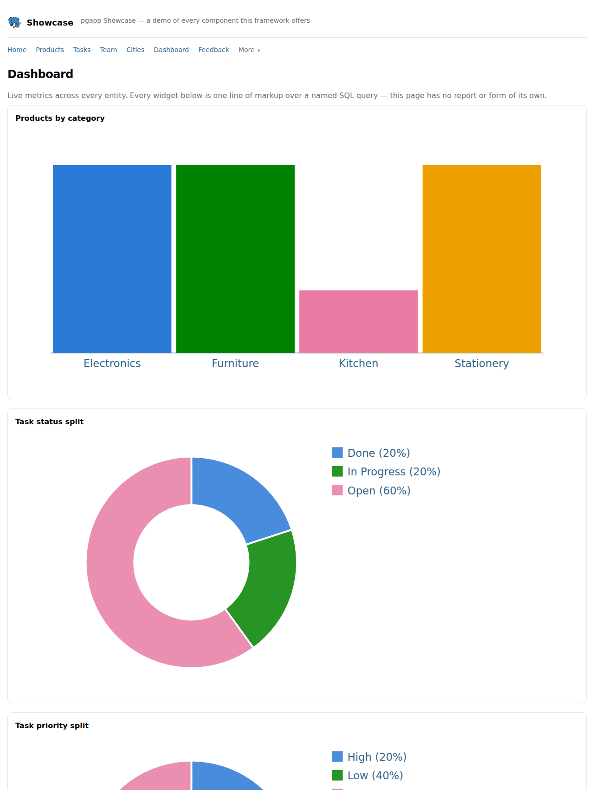
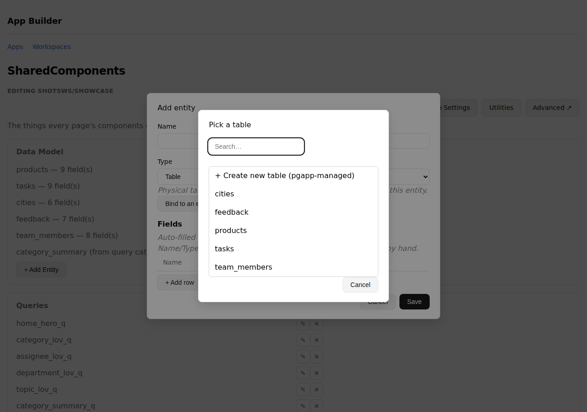
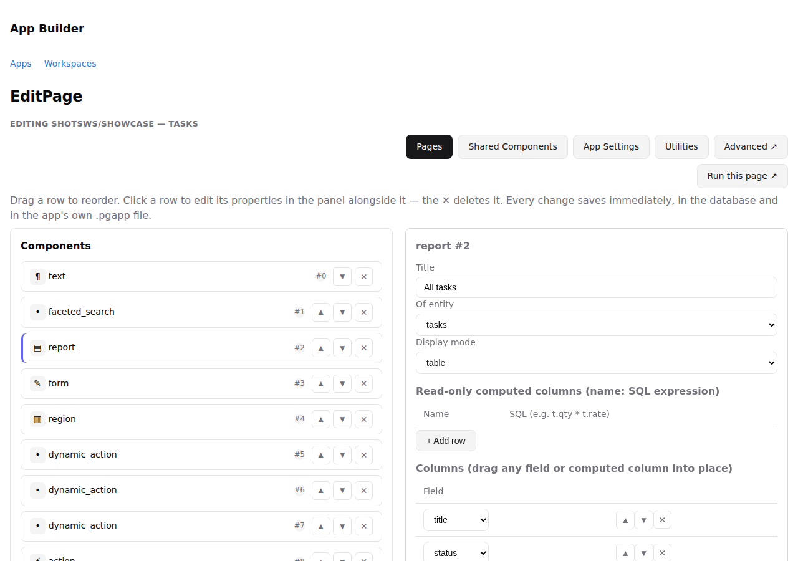
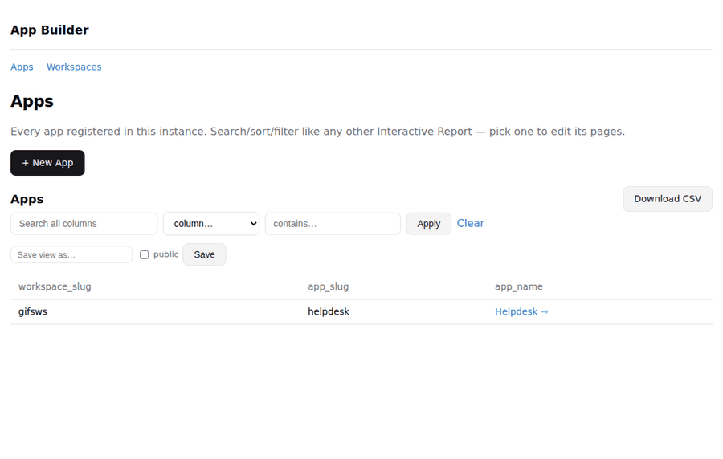
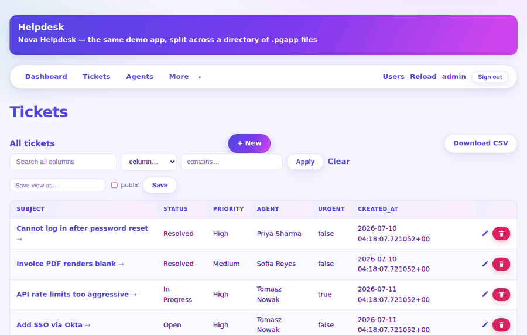

<div align="center">


# pgapp

### Postgres is the backend. This is everything else.

Describe a CRUD app in one plain-text file. Get back a live, multi-user
web app — reports, forms, charts, auth, and a point-and-click admin
builder — served by a single Rust binary that talks straight to
Postgres. No ORM. No separate API service. No JS build step.

[](https://www.rust-lang.org/)
[](https://www.postgresql.org/)
[](https://github.com/aadishajay/pgapp/stargazers)
[](./docs/roadmap.md)

[Quick start](#quick-start) ·
[Why pgapp](#why-pgapp) ·
[Example](#a-full-app-in-30-lines) ·
[App Builder](#the-app-builder) ·
[Docs](./docs/README.md) ·
[vs. Supabase/PocketBase/Appsmith](#how-this-compares)

</div>

---

> **Project status:** pre-1.0, actively developed, no stability
> guarantees yet. No `LICENSE` file is in the repo as of this writing
> — see [Roadmap](./docs/roadmap.md) before depending on this in
> production.

## A full app in 30 lines

```text
app "Todo" {
  nav {
    item "Tasks" -> page Tasks
  }

  entity "tasks" {
    field id: id
    field title: text required
    field priority: text default Medium
    field done: boolean default false
  }

  page "Tasks" {
    report "Tasks" of tasks {
      columns: title, priority, done
      page_size: 10
    }

    form "Add / edit task" of tasks {
      fields: title, priority, done
      item priority as radio ("Low", "Medium", "High")
    }
  }
}
```

That's a searchable, paginated, sortable list with inline create/edit/
delete — the classic Report+Form CRUD pattern — wired up automatically
because the Form and Report share an entity on the same page. No route
handlers, no SQL, no client-side JS written by you. Full grammar,
including named queries and every component kind:
[markup reference](./docs/markup.md).

## Screenshots

<table>
<tr>
<td width="50%">

**Interactive Report** — faceted search, sortable columns, and a
visible cue (that `→`) telling you a row is clickable before you ever
touch the mouse.



</td>
<td width="50%">

**Charts from one line of SQL each** — bar, donut, pie, and more,
every category getting its own consistent color automatically.



</td>
</tr>
<tr>
<td width="50%">

**The App Builder's entity editor** — pick a real table, and its
columns, nullability, and primary key populate the field list for you.



</td>
<td width="50%">

**The App Builder's page designer** — a component tree on the left,
a live property panel on the right, changes saved straight to the
`.pgapp` file.



</td>
</tr>
</table>

More in [`marketing/`](./marketing/), including a full
[feature-by-feature tutorial](./marketing/index.html).

**See it in action:**

<table>
<tr>
<td width="50%">

**Creating a new app** — pick a workspace and a theme, and it's live
at its own URL. No restart, no config file to hand-edit.



</td>
<td width="50%">

**Editing raw markup in the file editor** — a VS-Code-style file tree
for directory-based apps, syntax highlighting, saved straight back to
disk.



</td>
</tr>
</table>

## Quick start

**Prerequisites:** a reachable Postgres server and Rust installed.

```bash
# 1. Build and install the binary
cargo install --path .

# 2. One-time setup: an instance (per machine), a workspace (a schema
#    for your app's tables), and a scaffolded starter app, registered
#    to that workspace
pgapp instance init
pgapp workspace create --schema demo
pgapp app create --workspace demo

# 3. Serve it
pgapp run <generated-file>.pgapp --workspace demo
```

The last command prints the app's URL and starts serving it — that's
the whole loop. Every step is interactive and prompts you for what it
needs.

Want to see everything pgapp can do before writing your own app? Run
the bundled showcase instead of a blank scaffold:

```bash
pgapp workspace create --schema demo
pgapp run examples/showcase.pgapp --workspace demo
```

`examples/showcase.pgapp` is a single file that exercises every
component kind — reports, forms, an editable table, all six chart
types, a calendar, a map, faceted search, dynamic actions — with a
Home page linking to everything. Full walkthrough, including seed data
and the other bundled demos: [Getting started](./docs/getting-started.md).

## Why pgapp?

Most "app builder" tools make you stand up a second system just to
describe your app: a BaaS with its own auth service and API gateway, a
low-code SaaS with its own hosted runtime, or a Node backend you write
and deploy yourself. If Postgres already holds your data, that's one
extra moving part.

pgapp skips it. The **app definition is Postgres-native** — entities,
pages, and components live as rows in `pgapp_meta`, synced from a
plain-text `.pgapp` file you diff, review, and commit like any other
source file. The **server is one Rust binary** that reads that
metadata, builds parameterized SQL, and renders HTML directly. No
PostgREST, no Supabase Studio, no separate builder service, no
generated client SDK. Edit the file — or click through the built-in
[App Builder](#the-app-builder) — and reload. That's the deploy loop.

If you've used Oracle APEX, the shape will feel familiar: pages made
of Reports/Forms, PL/SQL-style server actions, declarative dynamic
actions, Interactive Reports with saved views. pgapp reimplements that
model deliberately, as an open, self-hosted, plain-text alternative
that runs on infrastructure you already have. See [Migrating from
Oracle APEX](./docs/migration-from-apex.md).

And it leans on Postgres directly rather than routing around it: a
named query's `:project_id` gets its bind type from Postgres's own
wire-protocol `Describe` message, not a hand-written cast, and every
entity's physical table is checked against its declared fields at
every startup and reload — failing loudly on drift instead of a
confusing runtime cast error. See [Named queries](./docs/markup.md#named-queries)
and [Deployment checks](./docs/reports.md#deployment-checks).

## Features

- **One file describes the whole app** — pages, entities, queries, nav, auth — synced on startup and on `/admin/reload`, no restart needed.
- **13 component kinds**: Report, Form, EditableTable, Chart, Calendar, Map, FacetedSearch, Region, DynamicContent, Action, Button, Link, Text. → [Components](./docs/components.md)
- **Interactive Reports** — search, per-column filters, saved views, sorting, aggregates, control breaks, CSV export, all declarative. → [Reports](./docs/reports.md)
- **19 built-in form field types**, plus a one-file-per-type plugin point for your own. → [Forms](./docs/forms.md)
- **6 chart types**, dependency-free inline SVG by default — or swap in any JS charting library. → [Charts](./docs/charts.md)
- **Server-side actions** — Rust modules or a plain PL/pgSQL call — wired to a button, a dynamic action, or a report's `before_load`. → [Actions](./docs/actions.md)
- **Declarative dynamic actions** (`on change of x { show/hide/set/refresh }`) plus a no-reload ajax callback.
- **Auth in one block** — `auth { }` turns on argon2-hashed logins, sessions, and role-gated pages/components down to the button. → [Authentication](./docs/authentication.md)
- **Pluggable everything** — themes, icons, chart backends, form widgets, six themes shipped. → [Theming](./docs/themes.md)
- **A built-in point-and-click admin app** for everything above. → [The App Builder](#the-app-builder)
- **Multi-tenant from one process** — instance → workspace (schema) → app, one connection pool for any number of apps. → [Architecture](./docs/architecture.md)

## Architecture

```
 .pgapp markup file
        │  parse
        ▼
    AppDef (in memory)
        │  validate + sync
        ▼
 pgapp_meta.* tables  ──creates──▶  <workspace_schema>.<table>  (your real data)
        │  load
        ▼
    RuntimeApp { pages → components }
        │
        ▼
   Axum router  ──  generic, metadata-driven CRUD + JSON
```

One Rust binary, one shared Postgres connection pool, any number of
apps. Every SQL identifier used at request time is validated at sync
time against the lexer's own identifier charset — safe to splice into
generated SQL; every user *value* is always a bind parameter. Full
diagram, source layout, and the complete route table:
[Architecture](./docs/architecture.md).

## Example applications

| App | What it shows |
|---|---|
| [`examples/todo.pgapp`](./examples/todo.pgapp) | The minimal shape — one entity, Report+Form CRUD, a chart |
| [`examples/helpdesk.pgapp`](./examples/helpdesk.pgapp) | Two entities, dashboards, both pagination modes, auth, every item type, the `vivid` theme |
| [`examples/venpay.pgapp`](./examples/venpay.pgapp) | A real Oracle APEX app hand-ported over — see [Migrating from Oracle APEX](./docs/migration-from-apex.md) |
| [`examples/showcase.pgapp`](./examples/showcase.pgapp) | Every component kind, all six chart types, all three server-side action styles, in 12 pages |
| [`examples/helpdesk-modular/`](./examples/helpdesk-modular/) | The helpdesk app split across files instead of one — same grammar, zero refactoring |
| [`examples/nexus-erp/`](./examples/nexus-erp/) | 200 pages, 60 entities, 15 files — the load-test fixture: 30 threads sustained ~900 req/s (p50 ~27ms, p99 ~94ms) with zero errors |

## The App Builder

Every pgapp instance ships with a built-in admin app — reachable at
`/pgapp/builder`, provisioned automatically — that lets you build and
edit apps by clicking instead of hand-editing markup over SSH: an
APEX-Page-Designer-style split view (clickable component tree + a
docked, typed property editor), full data-model and named-query
editing with suggestions drawn from real Postgres columns, encrypted
secrets, and live app/workspace scaffolding or teardown.

It's not a bespoke admin panel bolted onto the framework — **the App
Builder is itself just a pgapp app**, with one deliberate exception: a
hardcoded guard that refuses to let it edit itself, checked twice
(once in the listing, once again server-side on every mutating route).

Full walkthrough: [docs/app-builder.md](./docs/app-builder.md).

## Unique to pgapp

pgapp reimplements a lot of genuinely good ideas from Oracle APEX —
Interactive Reports, dynamic actions, a Page-Designer-style editor —
and that borrowing is not the interesting part. These are the pieces
that aren't an APEX port:

- **The app *is* a portable text file, and the GUI editor never
  breaks that.** Every App Builder mutation is a line-based **text
  splice** into your actual `.pgapp` file, so hand-written formatting
  and comments on everything you didn't touch survive byte-for-byte.
  Click through the UI or hand-edit the file — same source of truth,
  either way diff-friendly in git.
- **Bind types come from Postgres itself, not from you.** A named
  query's `:param` markers are typed by asking Postgres's own
  `Describe` message what type each one needs — fresh on every sync,
  no hand-declared cast, no ORM model layer.
- **One process, N tenants, hot-registered.** `pgapp run` adds an app
  to a live server's routing table with no restart and no downtime for
  anything already running.
- **The admin builder can't edit itself**, on purpose, checked in two
  independent places — a small, deliberate safety property most
  self-hosted admin tools don't bother with.

## How this compares

pgapp occupies a narrower, more opinionated niche than most of the
tools people reach for first — worth knowing before you pick it:

| | **pgapp** | Supabase | PocketBase | Appsmith / Budibase / ToolJet |
|---|---|---|---|---|
| Core language | Rust | Mostly TS + Postgres extensions | Go | Java / Node (varies by project) |
| App definition | Plain-text file, versioned in git | Dashboard + SQL + client SDKs | Dashboard + client SDKs | Drag-and-drop, stored as JSON |
| Database | Postgres — bring your own | Postgres (managed or self-hosted) | SQLite, embedded | Connects to a DB you already run |
| Runtime shape | One static binary | Multi-container stack (Studio, GoTrue, PostgREST, Realtime, Kong, ...) | One static binary | An app server (Node/Java) you deploy |
| Admin/builder UI | Built in, itself a pgapp app | Separate Studio service | Built-in admin UI | Yes — it's the whole product |
| Best fit | Postgres-first teams wanting typed CRUD apps fast, minimal moving parts | Full BaaS: auth, storage, realtime, edge functions | Small embedded backends, single binary deploys | Internal-tool builders, DB-agnostic, team-oriented |

None of these are strictly "better" — pgapp is for the case where
Postgres already is the answer to "where does the data live." Want a
full BaaS instead (auth/storage/realtime/edge-functions)? Supabase is
the more complete answer.

## Documentation

The docs live in [`docs/`](./docs/README.md) — this README is the
pitch, everything below is the reference:

| Doc | What's in it |
|---|---|
| [Getting started](./docs/getting-started.md) | Install, run your first app, bundled demos, scaffolding, instance mode |
| [Architecture](./docs/architecture.md) | The markup → metadata → runtime pipeline, source layout, full route table, multi-app routing |
| [Markup language](./docs/markup.md) | The complete `.pgapp` grammar — entities, pages, queries, directories, collections |
| [Components](./docs/components.md) | Every component kind in depth |
| [Reports](./docs/reports.md) | Pagination, search & saved views, computed columns, format masks, pre-load actions |
| [Forms & item types](./docs/forms.md) | The `ItemType` trait and every built-in field widget |
| [Charts & icons](./docs/charts.md) | Chart types, pluggable rendering backends, icon packs |
| [Authentication](./docs/authentication.md) | `auth {}`, roles, component-level `requires:`, auth schemes |
| [Actions](./docs/actions.md) | Server-side action modules, dynamic actions, ajax callbacks |
| [Theming](./docs/themes.md) | The CSS contract, shipped themes, mobile responsiveness |
| [App Builder](./docs/app-builder.md) | The full point-and-click admin app walkthrough |
| [Migrating from Oracle APEX](./docs/migration-from-apex.md) | Concept-for-concept mapping table |
| [Secrets](./docs/secrets.md) | Encrypted-at-rest credentials for actions |
| [Roadmap](./docs/roadmap.md) | Known gaps, honestly listed |

## Roadmap

pgapp is intentionally the smallest end-to-end loop, not the finished
framework. No real foreign-key relationships yet, no multi-step flow
blocks, no drag-and-drop free page composition, no `Secure`-cookie
story below TLS — the full, honest list (with the reasoning behind
each gap) is in [docs/roadmap.md](./docs/roadmap.md). If one of these
is a dealbreaker for your use case, that's useful to know up front,
and also exactly the kind of thing a PR is welcome for.

## Contributing

Issues and PRs are welcome — this is early, opinionated software, and
outside perspective on where it breaks is genuinely useful. Good first
places to look:

- [docs/roadmap.md](./docs/roadmap.md) for known gaps
- `src/item_types/` to add a new form field type (`date.rs` is the
  smallest real example)
- `src/actions/` to add a new server-side action module
- `themes/` to add a new design system (pure CSS, no Rust)

There's no `CONTRIBUTING.md` or issue templates yet — open an issue or
a PR and it'll get a response.

## License

**No license file has been added to this repository yet.** Until one
is, treat the code as all-rights-reserved for anything beyond reading
it. Adding a permissive license (MIT is the common default for the
Rust ecosystem) is tracked as an open item — see
[docs/roadmap.md](./docs/roadmap.md).
